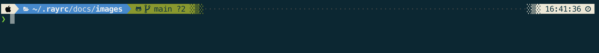
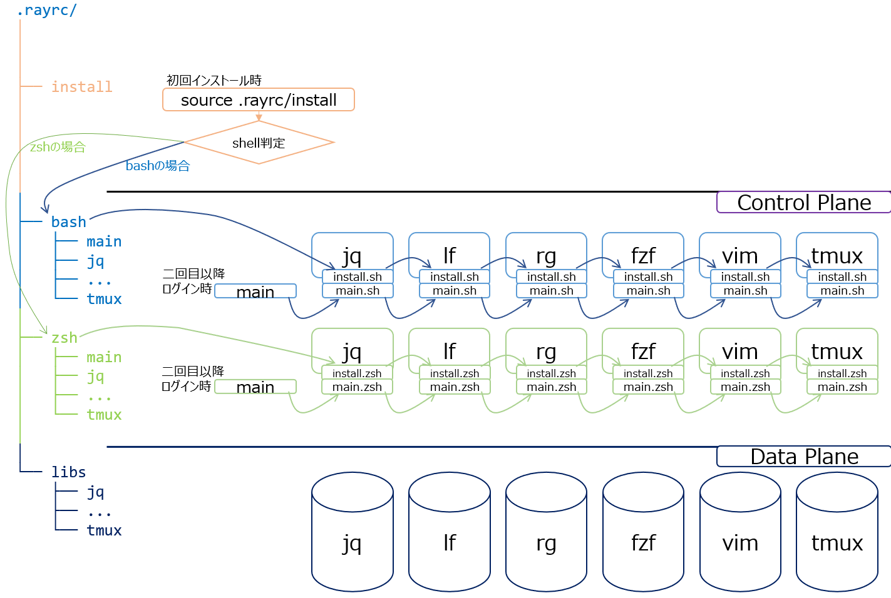

# Why

Recently I found that I'm working on newly created linux workstations so often that time by time I'm annoyed with these repeating work:

- set up my shell aliases, prompts, color schemas and custom functions, etc..
- install and configure my favorite [`bat`](https://github.com/sharkdp/bat), [`jq`](https://github.com/stedolan/jq), [`fzf`](https://github.com/junegunn/fzf), [`rg`](https://github.com/BurntSushi/ripgrep), [`fd`](https://github.com/sharkdp/fd), etc..
- install and configure vim plugins..

IT'S TIME to automate all of these with [**one command**](#how)!

# What

It's supposed to inlucde all my customizations on this machine.  
Yes, all my customizations.

> Why? (You may ask)
- Well, you know, there are many, that kind of, company policies, security rules, blahblah..

Anyway, I tried my best to include all customizations within inside the `$HOME/.rayrc` folder.

And, after installation, it gives me a consistent shell environment, whichever workstation I log in to.

## Features

Something like:

- beautiful and useful prompt

  - for Linux  
    
  - for Mac  
    

- auto-completion for frequently using commands

  - aws, k(kubectl), d(docker), dp(docker-compose)..

- some useful custom functions
  - k.conf..

# Who cares

## For me, and for all,

I created this for myself, but I expect this to work for anyone who wants a somehow beautiful and useful shell environment.

## but with some prerequisites

- Besides of this repo, we expect you to do some customizations for your terminal environment:
  - somehow nowadays terminal application? Like [Windows Terminal](https://docs.microsoft.com/en-us/windows/terminal/install) on Win, [iTerm2](https://iterm2.com/) on Mac..
  - [Nerd Fonts:](https://www.nerdfonts.com/) beautiful monospace fonts with highly crafted icons..
  - some colorschemas, like [Solarized](https://ethanschoonover.com/solarized/)..

# How

It should be easy to setup, as easy as running this one-line command:

## installation for Unix

```
git clone https://github.com/cr1315/.rayrc.git && source .rayrc/install
```

## installation for Windows (on working..)

```
git clone https://github.com/cr1315/.rayrc.git && . .rayrc/install.ps1
```

#### for test only

```
git clone -b dev_docker --single-branch --depth 1 https://github.com/cr1315/.rayrc.git && source .rayrc/install
```

## Architecture

It may sounds ridiculous to use the word "architecutre"..  
Whatever, I think you can understand the concept after you see this folder structure image:



# Some pricipals

I assume that this repo could create a **Pluggable Terminal rc Platform** with these considerations in mind:

- unified management
- idempotency
- extensibility / pluggable
